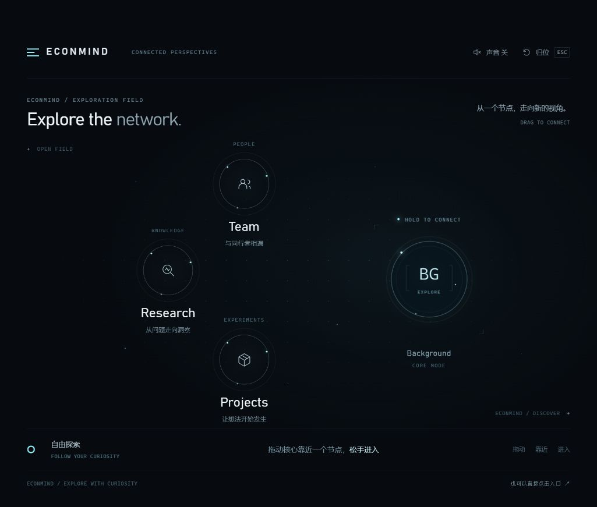

# Econmind · 空间节点导航

设计探索记录 · 2026-09-27 · V3

## 先体验

打开同目录下的 **[index.html](./index.html)**。这是一个可离线运行的独立 HTML，样式、脚本和图标均已内嵌，无需安装依赖或启动 Econmind。

按住右侧 **BG 核心节点**，拖向 Team、Research 或 Projects：靠近时吸附，松手后进入演示页面。空白处松手则弹回起点。也可以直接点击节点；键盘用户可聚焦核心后用方向键选择、Enter 确认、Esc 返回。音效默认关闭。

手机聊天应用可能只显示文件预览；请下载文件后用浏览器打开。目的页中的文字用于展示切换效果，正式接入时沿用网站现有内容。

## 设计起点

本轮官网入口探索始于访问方式的讨论和一张手绘布局：右侧是较大的 BG 主体，左侧分布 Team、Research 等入口，通过拖动表达“选择去哪里”。这一空间关系构成了原型的起点。

随后明确了三项设计取舍：

- **用接近表达选择。** 参考 Super Device 的空间吸附体验，将“拖向目标”的动作应用于官网导航。目标轻微迎接，核心吸附后由松手确认。
- **让空白区域可以撤销。** 未选中时松手，核心弹回起点；选中后直接进入页面。拖动不应迫使用户完成一次跳转。
- **以节点呈现入口。** 去掉实体按钮、玻璃高光和机械轨道，用独立圆形节点、细线光圈、信号点及节点下方的标签建立科技感。

早期讨论中的“换挡”只承担动作比喻。最终方向是自由的空间节点选择：没有轨道约束，也不需要把它做成一套机械控制器。

这份记录保存了从手绘空间关系到交互规则、再到节点视觉的设计脉络，供后续实现与评审沿用。

## 交互约定

| 状态 | 表现与结果 |
| --- | --- |
| 待机 | BG 核心在右侧，三个入口在左侧展开；不显示连接轨道。 |
| 拖动 | 核心自由跟随指针，保留轻微平滑跟随。 |
| 接近 | 最近节点高亮、轻微移动迎接；核心受到吸引。 |
| 选中 | 光圈增强并提示松手进入；小幅手抖不会立即取消选中。 |
| 松手 | 已选中则切换页面；未选中则弹回原点。 |
| 取消 | Esc、指针取消或窗口失焦时恢复可操作状态。 |

当前原型用 Pointer Events、指针捕获和 `requestAnimationFrame` 实现拖动；用弹簧式插值平滑位置。选择判定基于固定的节点坐标，避免视觉放大反过来改变命中范围。

桌面吸附半径为 150 px，确认半径为 68 px；窄屏分别为 91 px 和 51 px，已选中时保留 1.3 倍确认半径的释放余量。这些是当前试验值，后续应结合节点尺寸和实际使用反馈调整。

## 在 Econmind 中如何应用

### 接入位置

建议先作为首页或 Explore 页中的一个可选探索区域。当前首页由 `app/page.tsx` 引入 `components/home/editorial-home.tsx`，Explore 入口位于 `app/explore/page.tsx`。

首轮接入可新增独立的客户端组件，例如 `components/home/spatial-node-navigation.tsx`。该文件名仅为建议，本次记录没有创建或接入这个组件。

### 路由对应

| 原型节点 | 现有页面 / 后续决定 |
| --- | --- |
| Team | `/team`，对应 `app/team/page.tsx`。 |
| Research | `/research` 当前是 Evidence Lab；若指研究投稿与论文库，应评估 `/learn/research`。先确定信息含义，再决定路由。 |
| Projects | 当前是概念入口。仓库没有通用的 `/projects` 页面，需先确定项目目录的内容范围，不能直接跳到不存在的地址。 |
| BG / Background | 当前仅为探索起点。若要提供独立背景入口，可评估现有 `/about`，并单独约定点击行为。 |

### 实现拆分

1. 将节点配置整理为 `id`、标题、说明、图标、目标路径和相对位置；选择状态与页面内容分开管理。
2. 把拖动和吸附逻辑封装进组件或 Hook。位置、速度及指针信息使用 ref 管理，卸载时取消动画帧和计时器，移除全局监听。
3. 原型的 `engage()` 负责确认选择，`navigate()` / `renderRoute()` 展示演示页。正式接入时，在确认回调里调用现有路由机制；演示页和 hash 路由不移植。
4. 将原型中的 `body`、全局按钮样式与 CSS 变量限定到组件容器，并接入现有主题。避免把整页 CSS 复制到全站样式。
5. 保留普通链接、键盘入口和减少动态效果模式。现有 `components/layout/navbar.tsx` 继续承担全站导航、搜索和账户入口。
6. 初期以显式开关控制是否展示该探索区域，保留原有入口；确认移动端手势、可访问性及实际路由后再决定推广范围。

## 评审时重点看什么

- 不看说明，是否能理解右侧核心可以拖动？
- 接近、选中和松手进入，是否足够清楚且没有误触？
- 节点尺寸、位置、光圈强度是否适合官网整体视觉？
- Team、Research、Projects 是否对应真实且清晰的内容分类？
- 这种入口更适合首页首屏、Explore 页面，还是一个可展开的导航层？

## 当前验证与边界

已在桌面浏览器验证自由拖动、空白释放回弹、吸附后进入 Research 页面及 Esc 返回；已检查 390 px 窄屏布局。前一轮原型还验证了三个演示入口、键盘选择和浏览器返回。真实手机触控、更多浏览器及生产路由接入仍需后续验证。

本目录只归档设计与演示资料，没有被应用代码引用，也没有放入 `public/`。此次提交不修改应用路由、导航栏、主题、依赖、数据库或构建配置。

## 文件

- `index.html`：当前节点式交互原型，单文件离线运行。
- `preview.png`：当前版本的桌面预览。
- `README.md`：设计记录、交互约定及接入建议。

转发时可发送整个压缩包；只看交互时也可单独发送 `index.html`。本机预览使用的 `127.0.0.1` 地址不能作为他人的访问链接。
